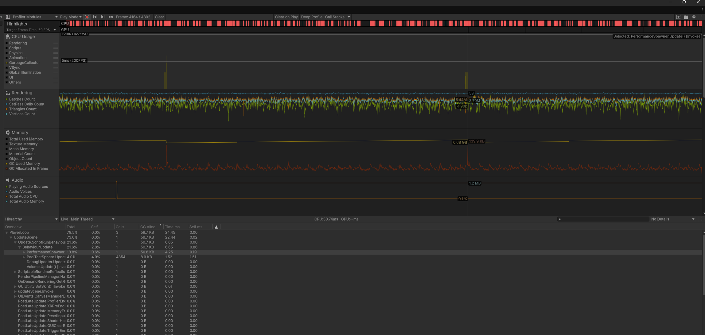
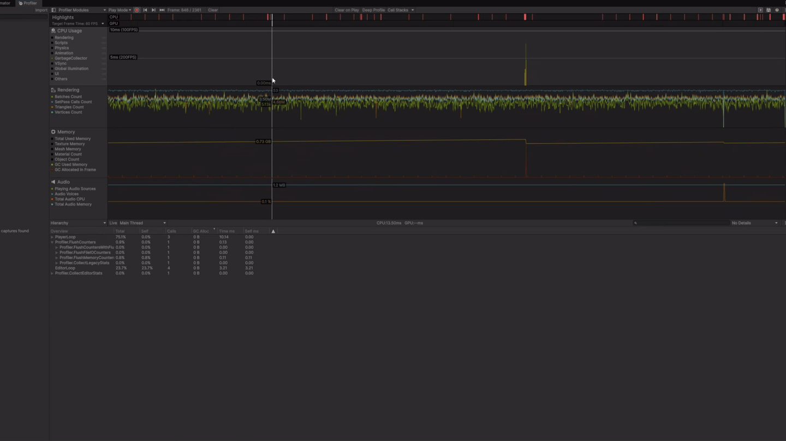
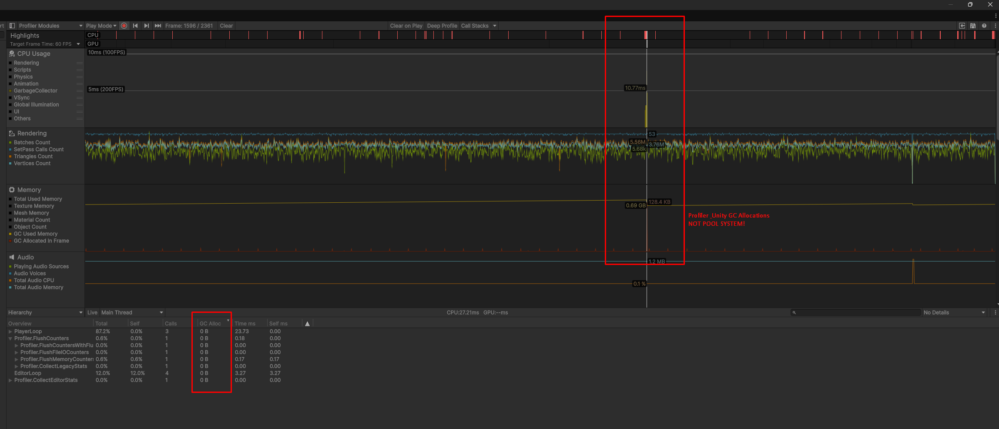

# DmrPoolSystem

**High-performance object pooling for Unity**

This is a generic pooling system built for games that spawn/destroy objects constantly. It eliminates GC allocations during runtime, which means no more frame drops from garbage collection spikes.

Key features:
- **Zero allocation** during steady-state operation
- **Recursion safe** - pooled objects can spawn other pooled objects without breaking
- **O(1) integrity checks** using HashSet to prevent double-returns
- **Auto-cleanup** handles destroyed references and scene changes gracefully

---

## Performance

### Stress Test: 5,000 Active Objects

<div align="center">
  
  <p><em>5,000 objects cycling continuously with zero GC.</em></p>
</div>

### Profiler Comparison

**Standard Instantiate/Destroy:**

- ~55KB allocated per frame
- Constant GC spikes causing stutters

**With DmrPoolSystem:**


- 0 Bytes allocated (flat line)
- Much Smoother frametime

> **Note:** Small allocation spikes are Unity Editor overhead and can be seen in memory profiler. The actual game code (`BehaviourUpdate`) allocates 0 bytes.

### Benchmark Details

**Test Hardware:** Ryzen 7 9800X3D + RTX 5070 Ti  
**Test Load:** 5,000 active objects

On this hardware, switching to pooling gave a 10-15 FPS boost. But the real improvement is **frametime stability**.

Without pooling, the GC runs constantly to clean up that 55KB/frame, causing micro-stutters. These "1% lows" make the game feel laggy even at high FPS.

With pooling, frametime is rock solid:
- **High-end hardware:** Eliminates micro-stutters
- **Mobile/low-end:** Prevents complete freezes during GC

---

## How It Works

**Core Design:**
- Uses `Stack<List<IPoolableGameObject>>` for recursion safety - pooled objects can spawn other pooled objects during `OnPoolGet` without breaking the buffer
- `HashSet<GameObject>` for O(1) validation - prevents double-return bugs
- Auto-expanding buffer when legitimate load increases

### Edge Case Handling

The hardest part of pooling is dealing with external destruction (scene changes, accidental `Destroy()` calls, etc). Here's how it's handled:

**1. Auto-Expansion**

If the active object buffer fills up legitimately (you spawned more than expected), it doubles the size:

```csharp
// If the buffer is full but valid, we double the size to prevent future stutter
_rememberBufferMaxSize = _rememberBufferMaxSize * 2;
Debug.Log($"Pool buffer legitimate load detected. Auto-expanding limit to {_rememberBufferMaxSize}...");
```

**2. Garbage Cleanup**

When the buffer hits its limit, `CleanUpPoolGarbage()` runs to find and remove null references (destroyed objects).

This is an O(N) scan that does cause some GC, but it only runs when something goes wrong (buffer overflow, destroyed prefabs, scene changes). 
It's not on the hot path - normal spawn/despawn is still zero-alloc.
And if the overflow is legit (No destroyed pool objects) the pool system will just dynamically resize itself to not trigger this GC again.

- O(N) operation, only runs when buffer overflows
- Prevents memory leaks and missing reference exceptions

**3. Dead Prefab Protection**

If you delete a prefab asset but still try to spawn it, the pool detects this and removes the associated pool entries:

```csharp
private void CheckForRemovedPrefabs()
{
    // Scans for keys (Prefabs) that have become null
    // Removes the entire associated pool to prevent instability
    foreach (var key in nullKeys)
    {
        Debug.LogWarning("Destroyed prefab detected. Removing associated pool...");
        _currentPool.Remove(key);
    }
}
```

---

## 💻 Usage

### 1. Implement the Interface

Attach this to any prefab you intend to pool.

```csharp
using DmrPoolSystem;
using UnityEngine;

public class Bullet : MonoBehaviour, IPoolableGameObject
{
    private Rigidbody _rb;

    public void OnPoolGet()
    {
        // Reset state (Called when spawned)
        if (_rb == null) _rb = GetComponent<Rigidbody>();
        _rb.velocity = Vector3.zero; 
        gameObject.SetActive(true);
    }

    public void OnPoolReturn()
    {
        // Cleanup logic (Called when returned)
        StopAllCoroutines();
    }
}
```

### 2. Initialize the Pool

Use the `DmrPoolInstance` class to manage your objects.

```csharp
public class GameManager : MonoBehaviour
{
    [SerializeField] private GameObject _bulletPrefab;
    
    // Pool Instance
    private DmrPoolInstance<Bullet> _bulletPool;

    private void Start()
    {
        // Initialize: Name, DontDestroyOnLoad, BufferSize, Warnings
        _bulletPool = new DmrPoolInstance<Bullet>("BulletPool", false, 100, true);
        
        // Pre-warm the pool to avoid runtime instantiation (This isn't mandatory)
        _bulletPool.RegisterPoolObject(_bulletPrefab, 50);
    }

    public void FireWeapon()
    {
        // Spawn
        Bullet newBullet = _bulletPool.GetPoolObject(_bulletPrefab);
        if (newBullet != null) 
        {
            newBullet.transform.position = transform.position;
        }
    }

    public void DespawnBullet(Bullet bullet)
    {
        // Return
        _bulletPool.ReturnPoolObject(bullet);
    }
}
```
